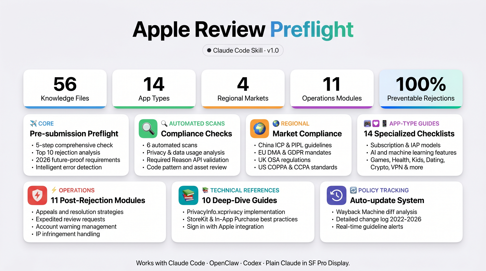

# Apple Review Preflight

> A comprehensive AI skill for Apple App Store review compliance — covering pre-submission checklists, rejection prevention, appeals, and policy tracking.

**English** | [中文](#中文)

---

## Feature Map

→ **[View Interactive Feature Map](docs/feature-map.html)** — open in browser for the full visual overview.



---

## What Is This?

A structured knowledge base and AI skill that helps app developers:

- **Prevent rejections** before submission (covers the top 10 rejection reasons)
- **Navigate rejections** with correct response strategies
- **Stay current** with Apple's evolving guidelines (auto-tracked)
- **Handle edge cases** — regional compliance, account warnings, expedited review, IP disputes, and more

Built on Apple's 2026 review data: 7.7M submissions reviewed, 1.9M rejected. **Most rejections are 100% preventable.**

---

## Coverage

| Area | Files |
|------|-------|
| App-type checklists | 14 types (subscription, AI, games, health, kids, dating, ecommerce, crypto, VPN, UGC, macOS, tvOS, watchOS, visionOS) |
| Pre-submission scans | Privacy manifest, Required Reason APIs, background modes, code patterns, metadata |
| Regional compliance | China (ICP/PIPL), EU/EEA (DMA/GDPR), UK (OSA/UKGC), US (COPPA/CCPA) |
| Operations | Rejections, appeals, expedited review, account warnings, IP infringement, editorial featuring, phased release, CI/CD |
| Policy tracking | Automated guideline update detection, change log, source mapping |

---

## Installation

### Claude Code

```bash
# Clone to your skills directory
git clone https://github.com/YishanCoding/apple-review-preflight ~/.claude/skills/apple-review-preflight
```

Then invoke in Claude Code:

```
/apple-review-preflight
```

### OpenClaw / Codex

```bash
# Clone and symlink to your agent-skills directory
git clone https://github.com/YishanCoding/apple-review-preflight ~/agent-skills/agents-skills/apple-review-preflight
```

### Plain Claude (no CLI)

Copy the contents of `SKILL.md` and paste into your conversation as a system prompt or initial message.

### Keep Updated

```bash
cd ~/.claude/skills/apple-review-preflight && git pull
```

---

## Quick Start

### Pre-submission check (5 steps)

1. **Scan your project** — run the commands in `SKILL.md` Step 1
2. **Load your app type** — find your category in `by-app-type/`
3. **Run compliance checks** — `checks/review-failure-map.md` + `checks/privacy-transparency-consistency.md`
4. **Check regional rules** — `market-overrides/` for China/EU/UK/US
5. **Generate report** — use `checks/report-template.md`

### After a rejection

Go to `operations/review-ops.md` — it covers response strategy, appeal templates, and when to reply vs. resubmit.

### Route by scenario

| Scenario | File |
|----------|------|
| Expedited review | `operations/expedited-review.md` |
| Account warning / Pending Termination | `operations/account-warnings.md` |
| IP infringement dispute | `operations/ip-infringement.md` |
| App removed / keyword penalty | `operations/app-penalty-recovery.md` |
| Editorial featuring | `operations/editorial-featuring.md` |

---

## Policy Updates

Apple updates its guidelines regularly. To check for changes:

```bash
bash policy/scripts/check-guideline-updates.sh
```

See `policy/update-playbook.md` for the full update workflow.

---

## Contributing

PRs welcome for:
- New app-type guides
- Regional compliance updates
- Corrections to guideline references
- New rejection patterns

Please open an issue before large changes.

---

## License

MIT

---

---

# 中文

## 这是什么？

一个结构化的 Apple App Store 审核合规 AI Skill，帮助开发者：

- **提交前预防拒审**（覆盖 Top 10 拒审原因）
- **被拒后正确应对**（回复策略 + 申诉模板）
- **跟踪政策变化**（自动检测 Guidelines 更新）
- **处理复杂场景**（区域合规、账号警告、加急审核、知识产权争议等）

---

## 安装

### Claude Code

```bash
git clone https://github.com/YishanCoding/apple-review-preflight ~/.claude/skills/apple-review-preflight
```

安装后在 Claude Code 中输入：

```
/apple-review-preflight
```

### OpenClaw / Codex

```bash
git clone https://github.com/YishanCoding/apple-review-preflight ~/agent-skills/agents-skills/apple-review-preflight
```

### 纯 Claude（无 CLI）

将 `SKILL.md` 内容复制粘贴到对话开头作为上下文。

### 保持更新

```bash
cd ~/.claude/skills/apple-review-preflight && git pull
```

---

## 快速上手

**提交前预检**：按 `SKILL.md` 的 5 步流程执行

**被拒后**：进入 `operations/review-ops.md`

**政策更新检查**：
```bash
bash policy/scripts/check-guideline-updates.sh
```

---

## 覆盖范围

| 模块 | 内容 |
|-----|------|
| App 类型专项 | 14 种（订阅、AI、游戏、健康、儿童、交友、电商、加密、VPN、UGC、macOS、tvOS、watchOS、visionOS） |
| 预检扫描 | 隐私清单、Required Reason API、后台模式、代码模式、元数据 |
| 区域合规 | 中国大陆（ICP/PIPL）、欧盟（DMA/GDPR）、英国（OSA）、美区（CCPA/外部支付） |
| 运营操作 | 被拒处理、申诉、加急审核、账号警告、知识产权、精品推荐、分阶段发布、CI/CD |
| 政策追踪 | 自动变更检测、更新日志、来源映射 |

---

## License

MIT
