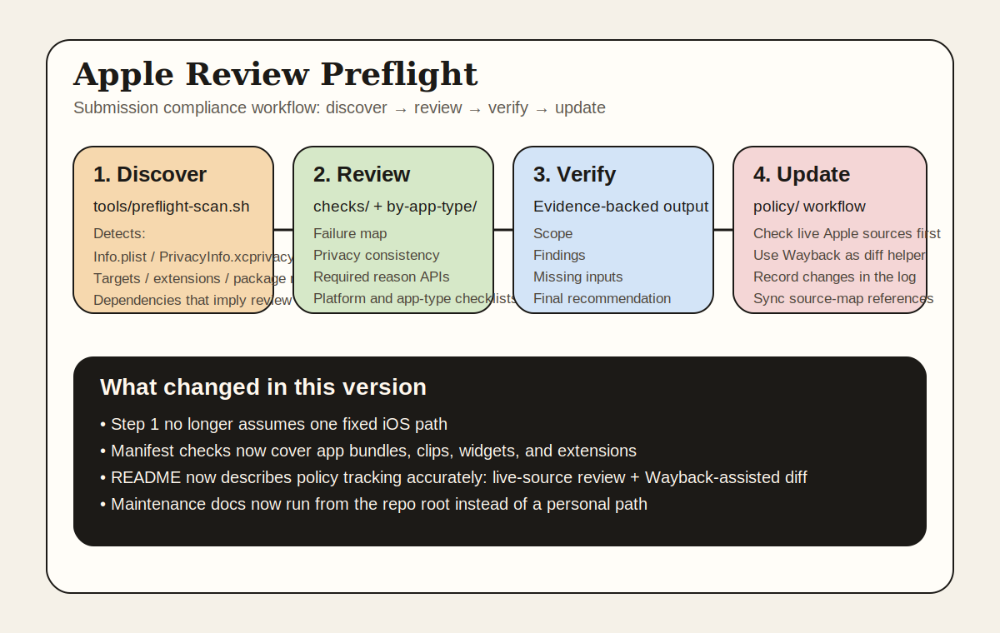
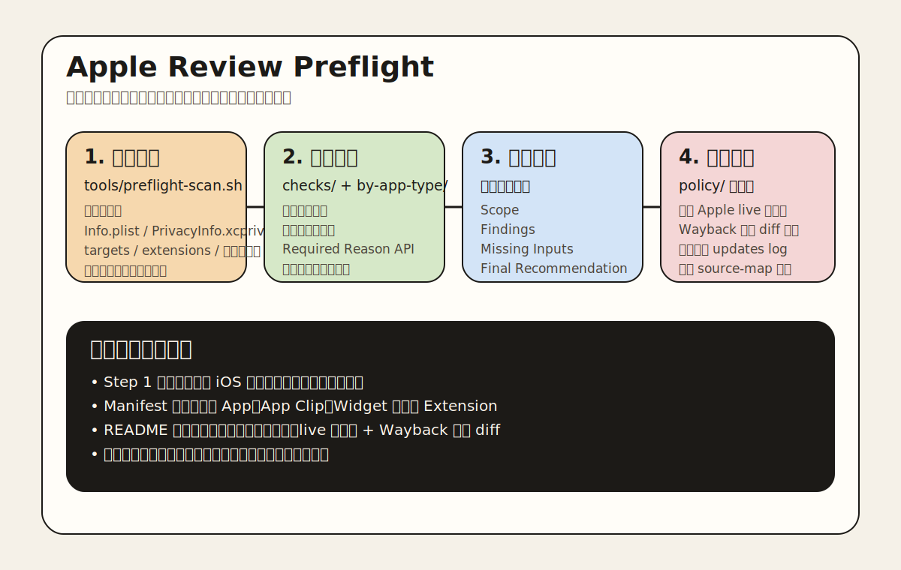

# Apple Review Preflight

> A comprehensive AI skill for Apple App Store review compliance — covering pre-submission checklists, rejection prevention, appeals, and policy tracking.

**English** | [中文](#中文)

---



## What Is This?

A structured knowledge base and AI skill that helps app developers:

- **Prevent rejections** before submission (covers the top 10 rejection reasons)
- **Navigate rejections** with correct response strategies
- **Stay current** with Apple's evolving guidelines (live-source review + Wayback-assisted diff)
- **Handle edge cases** — regional compliance, account warnings, expedited review, IP disputes, and more

Built on Apple's 2026 review data: 7.7M submissions reviewed, 1.9M rejected. **Most rejections are 100% preventable.**

---

## Coverage

| Area | Files |
|------|-------|
| App-type checklists | 14 types (subscription, AI, games, health, kids, dating, ecommerce, crypto, VPN, UGC, macOS, tvOS, watchOS, visionOS) |
| Pre-submission scans | Project-structure discovery, privacy manifest coverage, Required Reason APIs, background modes, code patterns, metadata |
| Operations | Rejections, appeals, expedited review, review timing &amp; submission windows, account warnings, IP infringement, editorial featuring, phased release, CI/CD |
| Automation scripts | `scripts/preflight-scan.{py,sh}` for structure-aware project scanning; `policy/scripts/check-live-sources.sh` for live Apple source tracking; `policy/scripts/check-guideline-updates.sh` for Wayback history diff |
| Policy tracking | Live-source review workflow, Wayback-assisted diff, change log, source mapping, monthly review playbook |

---

## Installation

Skills are auto-discovered when placed in the agent's skill directory. The skill name comes from the `SKILL.md` frontmatter `name` field (`apple-review-preflight`), so keep the directory name aligned.

### Claude Code

```bash
git clone https://github.com/YishanCoding/apple-review-preflight ~/.claude/skills/apple-review-preflight
```

Restart Claude Code so the skill is indexed. Verify by typing `/` and confirming `apple-review-preflight` appears in the skill list.

### OpenClaw

```bash
git clone https://github.com/YishanCoding/apple-review-preflight ~/agent-skills/agents-skills/apple-review-preflight
```

### Codex

Codex shares OpenClaw's `agents-skills/` directory in many setups. If your environment uses a different scanned skill root, clone or symlink this repo into that directory and reload your agent app if needed.

### Shared setup across Claude Code + OpenClaw + Codex

```bash
git clone https://github.com/YishanCoding/apple-review-preflight ~/agent-skills/agents-skills/apple-review-preflight
ln -s ~/agent-skills/agents-skills/apple-review-preflight ~/.claude/skills/apple-review-preflight
```

### Plain Claude (no CLI)

Copy the contents of `SKILL.md` and paste into your conversation as a system prompt or initial message.

### Keep Updated

```bash
cd ~/.claude/skills/apple-review-preflight && git pull
# or, if using the shared setup:
cd ~/agent-skills/agents-skills/apple-review-preflight && git pull
```

---

## Quick Start

### Pre-submission check

1. **Scan your project structure**:
```bash
bash scripts/preflight-scan.sh /path/to/your/project
```
2. **Load your app type** — find your category in `by-app-type/`
3. **Run compliance checks** — `checks/review-failure-map.md` + `checks/privacy-transparency-consistency.md`
4. **Check regional rules** — `market-overrides/` for China/EU/UK/US
5. **Generate report** — use `checks/report-template.md` and follow the `Scope / Findings / Missing Inputs / Evidence / Final Recommendation` contract in `SKILL.md`

### After a rejection

Go to `operations/review-ops.md` — it covers response strategy, appeal templates, and when to reply vs. resubmit.

### Route by scenario

| Scenario | File |
|----------|------|
| Expedited review | `operations/expedited-review.md` |
| Account warning / Pending Termination | `operations/account-warnings.md` |
| IP infringement dispute | `operations/ip-infringement.md` |
| App removed / keyword penalty | `operations/app-penalty-recovery.md` |
| Editorial featuring | `operations/editorial-featuring.md` |

---

## Policy Updates

Apple updates its guidelines regularly. The recommended workflow is:

1. Review live Apple sources first: Developer News, Upcoming Requirements, Guidelines, and relevant ASC Help pages
2. Run the live-source checker to diff current official content against your cached baseline
3. Use Wayback as a historical helper when you need to answer "when did this change?"
4. Record confirmed changes in `policy/policy-updates-log.md`

```bash
# Primary: live Apple sources
bash policy/scripts/check-live-sources.sh

# Auxiliary: historical snapshot diff
bash policy/scripts/check-guideline-updates.sh
```

See `policy/update-playbook.md` for the full maintenance workflow.

---

## Contributing

PRs welcome for:
- New app-type guides
- Regional compliance updates
- Corrections to guideline references
- New rejection patterns

Please open an issue before large changes.

---

## License

MIT

---

---

# 中文



## 这是什么？

一个结构化的 Apple App Store 审核合规 AI Skill，帮助开发者：

- **提交前预防拒审**（覆盖 Top 10 拒审原因）
- **被拒后正确应对**（回复策略 + 申诉模板）
- **跟踪政策变化**（先看 Apple live 官方源，再用 Wayback 辅助对比）
- **处理复杂场景**（区域合规、账号警告、加急审核、知识产权争议等）

---

## 覆盖范围

| 模块 | 内容 |
|------|------|
| App 类型专项 | 14 种（订阅、AI、游戏、健康、儿童、交友、电商、加密、VPN、UGC、macOS、tvOS、watchOS、visionOS） |
| 预检扫描 | 项目结构探测、manifest 覆盖率检查、Required Reason API、后台模式、代码模式、元数据 |
| 自动化脚本 | `scripts/preflight-scan.{py,sh}`、`policy/scripts/check-live-sources.sh`、`policy/scripts/check-guideline-updates.sh` |
| 政策追踪 | live 官方源检查、Wayback 辅助 diff、更新日志、来源映射、月度复查 playbook |

---

## 安装

Skill 通过约定目录被 agent 自动发现。Skill 名取自 `SKILL.md` frontmatter 的 `name` 字段（本 skill：`apple-review-preflight`），目录名保持一致。

### Claude Code

```bash
git clone https://github.com/YishanCoding/apple-review-preflight ~/.claude/skills/apple-review-preflight
```

重启 Claude Code 让索引加载新 skill。在输入框打 `/` 确认 `apple-review-preflight` 出现在列表中。

### OpenClaw

```bash
git clone https://github.com/YishanCoding/apple-review-preflight ~/agent-skills/agents-skills/apple-review-preflight
```

### Codex

很多环境里 Codex 会共享 OpenClaw 的 `agents-skills/` 目录。如果你的环境使用别的 skill 扫描目录，就 clone 或 symlink 到那个目录里，然后刷新 skill 索引。

### 三端共享（Claude Code + OpenClaw + Codex）

```bash
git clone https://github.com/YishanCoding/apple-review-preflight ~/agent-skills/agents-skills/apple-review-preflight
ln -s ~/agent-skills/agents-skills/apple-review-preflight ~/.claude/skills/apple-review-preflight
```

### 纯 Claude（无 CLI）

将 `SKILL.md` 内容复制粘贴到对话开头作为上下文。

### 保持更新

```bash
cd ~/.claude/skills/apple-review-preflight && git pull
# 或者使用三端共享方案的话：
cd ~/agent-skills/agents-skills/apple-review-preflight && git pull
```

---

## 快速上手

### 提交前预检

```bash
bash scripts/preflight-scan.sh /path/to/your/project
```

然后按 `SKILL.md` 的 5 步流程执行，并用 `checks/report-template.md` 输出报告。

**被拒后**：进入 `operations/review-ops.md`

### 政策更新检查

```bash
# 主路径：live Apple 官方源
bash policy/scripts/check-live-sources.sh

# 辅助：Wayback 历史快照
bash policy/scripts/check-guideline-updates.sh
```

完整维护流程见 `policy/update-playbook.md`。

---

## License

MIT
